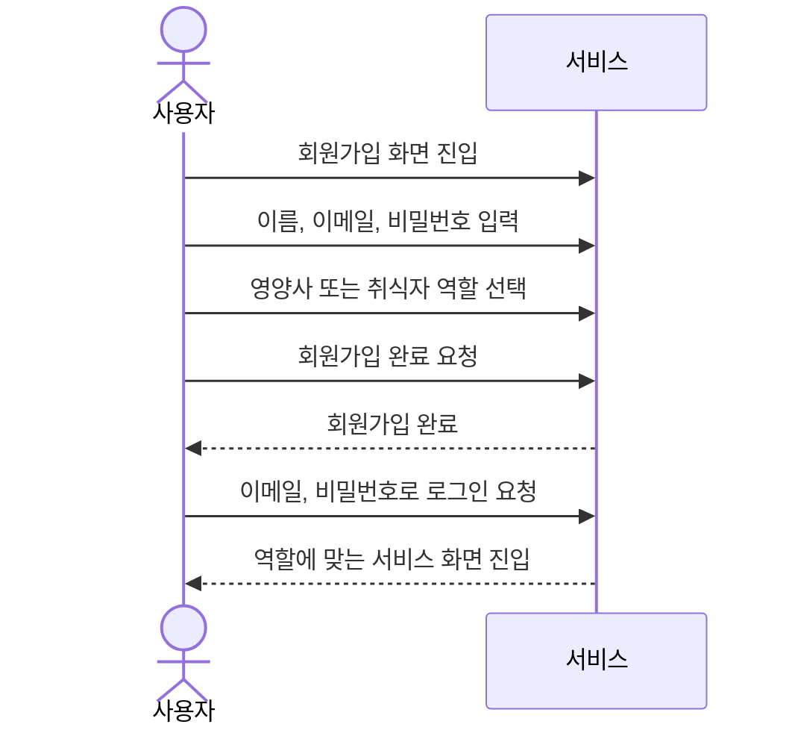
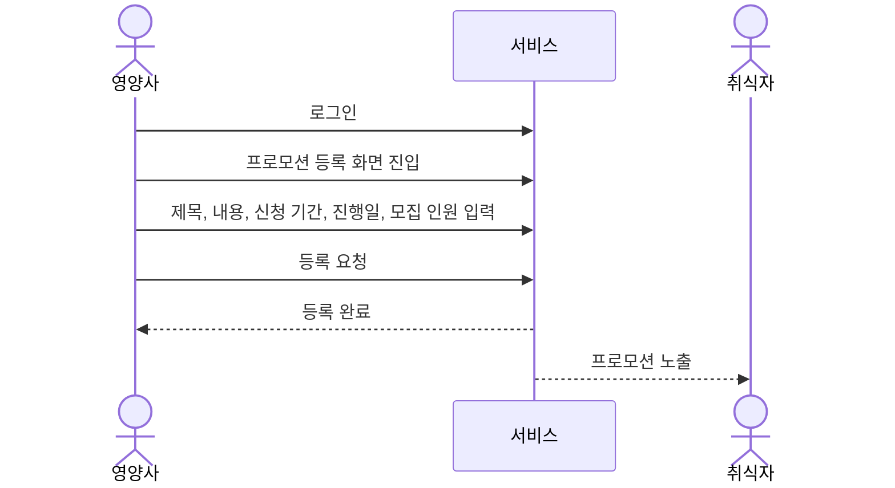
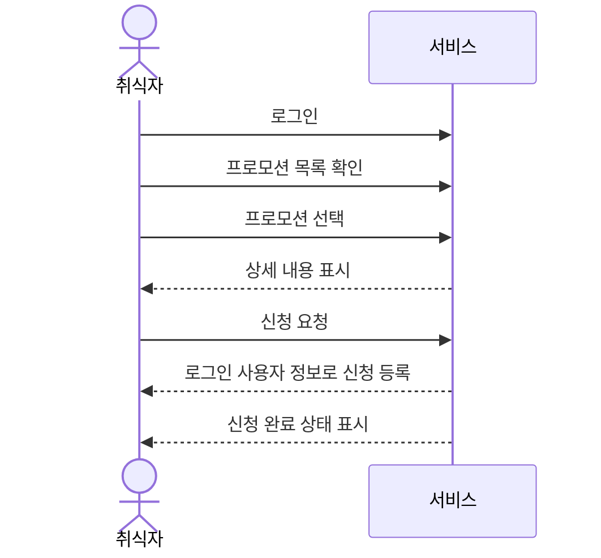
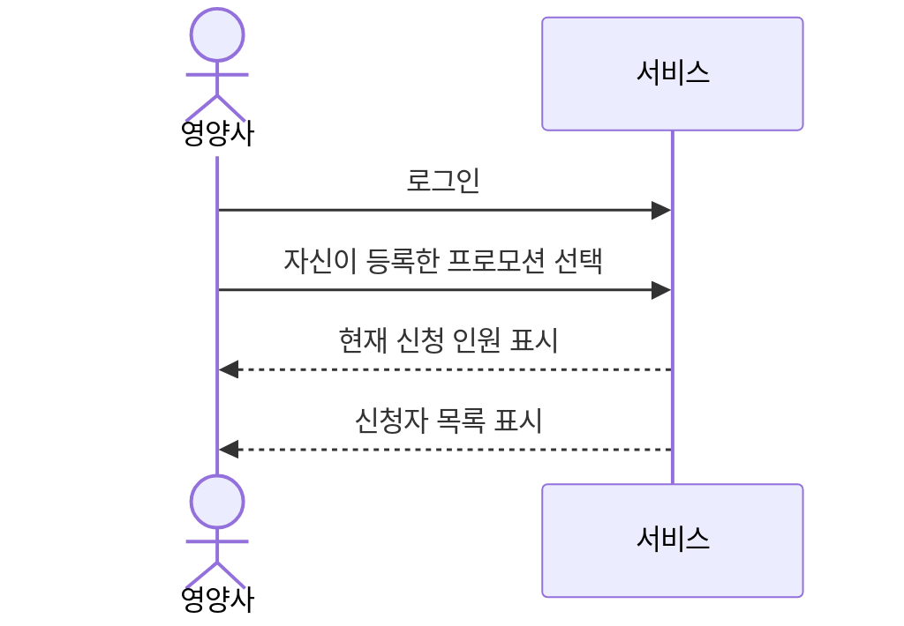

# 주요 사용자 시나리오 다이어그램

`prompts/domain-definition.md` 8장(주요 사용자 시나리오) 내용을 mermaid 시퀀스 다이어그램으로 표현한다.

## 1. 회원가입 및 로그인

## 2. 영양사가 프로모션을 등록하는 경우

## 3. 취식자가 프로모션을 신청하는 경우

## 4. 영양사가 신청 현황을 확인하는 경우

