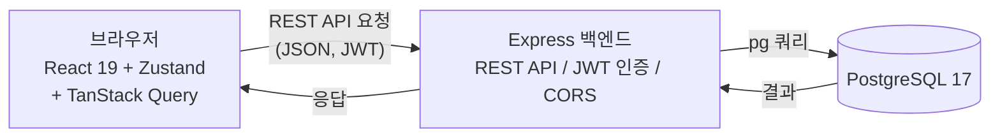
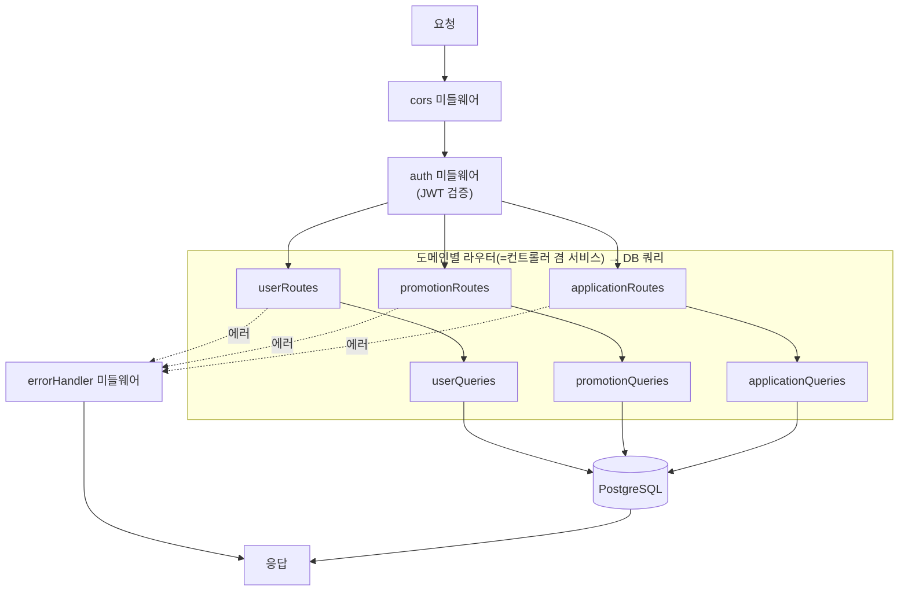
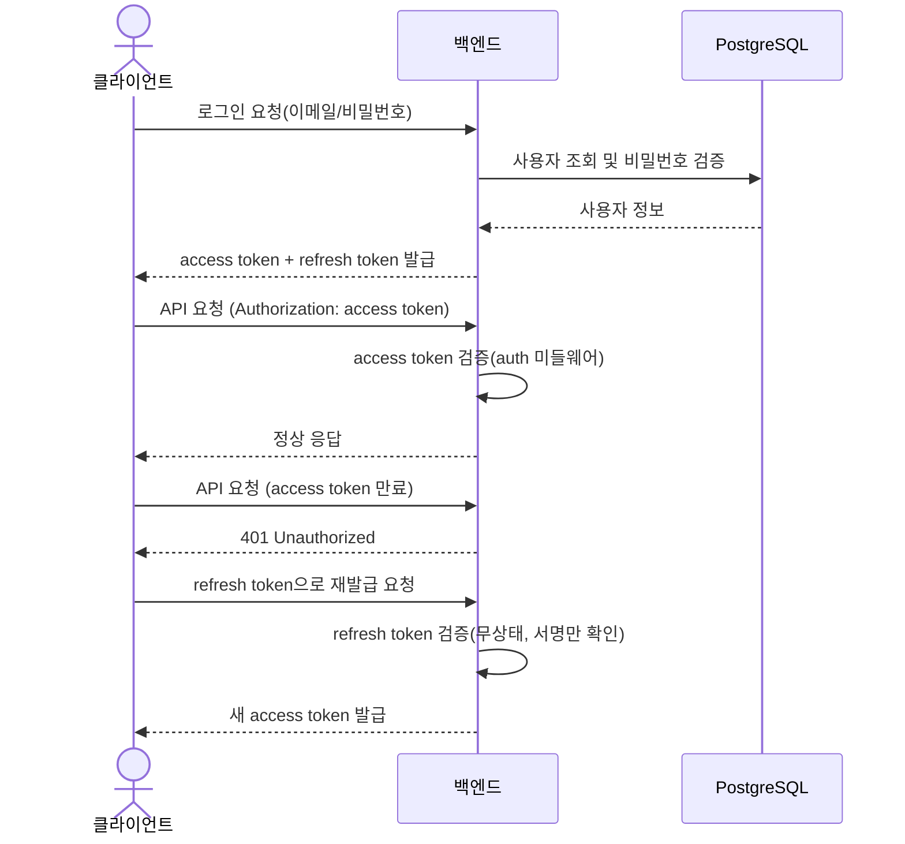
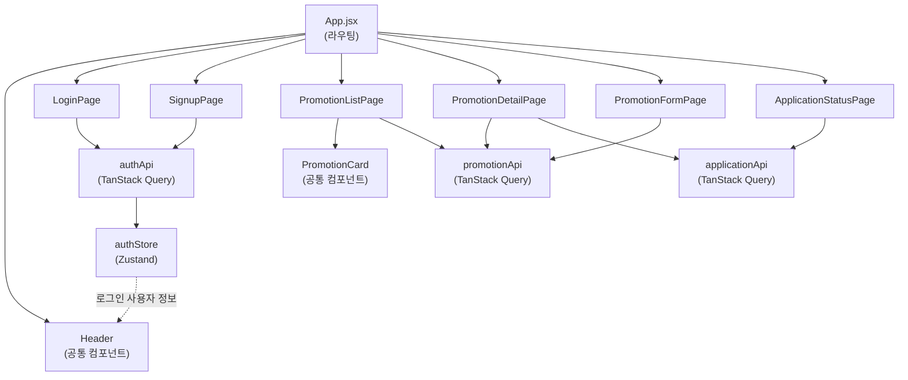

# 기술 아키텍처 다이어그램

> 1인 개발 3일 MVP 기준. 실제 존재하는 컴포넌트(브라우저, React 프론트, Express 백엔드 1개, PostgreSQL 1개)만 표현한다.

## 1. 전체 시스템 구성도

브라우저에서 실행되는 React 앱이 Express 백엔드에 REST API로 요청하고, 백엔드가 PostgreSQL에 직접 쿼리하는 단순 3단 구성이다.

## 2. 백엔드 내부 레이어 구성도

라우터 → 컨트롤러 겸 서비스 → DB 쿼리로 이어지는 3레이어이며, 미들웨어(cors/auth/errorHandler)를 공통으로 거친다. user/promotion/application 세 도메인이 동일한 구조로 나란히 존재한다.

## 3. 인증 흐름도

로그인 시 access/refresh token을 함께 발급하고, 이후 요청은 access token으로 검증하며, 만료 시 refresh token으로 access token만 재발급받는 흐름이다.

## 4. 프론트엔드 컴포넌트 구조도

`doc/5-project-principle.md`의 디렉토리 구조 기준으로, 페이지가 공통 컴포넌트를 조합하고 api 훅(TanStack Query)과 store(Zustand)를 사용하는 구조다.

