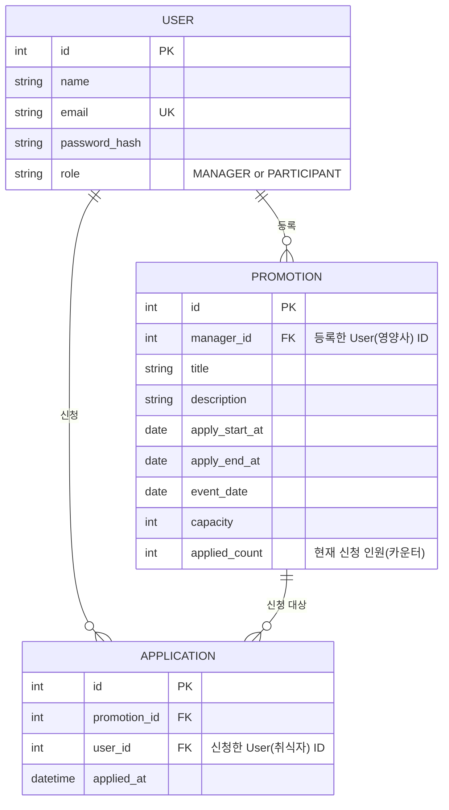

# 단체급식 프로모션 신청 서비스 ERD

> 도메인 정의서(`doc/1-domain-definition.md`)와 PRD(`doc/2-PRD.md`)를 기준으로 작성. MVP 범위상 테이블은 User/Promotion/Application 3개로 유지한다(PRD 8장).

## ER 다이어그램

## 엔티티 설명

### USER

서비스 회원. 영양사(`MANAGER`)와 취식자(`PARTICIPANT`) 역할을 `role` 컬럼으로 구분한다(도메인 정의서 5장).

- `email`은 유니크 제약으로 중복 가입을 방지한다(도메인 정의서 4장).
- `password_hash`는 도메인 정의서에는 없던 컬럼이지만, PRD 7장의 "비밀번호 해시 저장" 요구사항을 반영해 추가했다.

### PROMOTION

영양사가 등록하는 프로모션. `manager_id`로 등록자를 참조한다(User 1 : N Promotion, 도메인 정의서 6장).

- `capacity`(모집 인원)와 신청 시작/종료일, 진행일을 가진다.
- 진행일(`event_date`)은 신청 종료일(`apply_end_at`) 이상이어야 한다는 제약은 애플리케이션/DB 체크로 처리한다(도메인 정의서 7장).
- `applied_count`는 도메인 정의서에는 없던 컬럼이지만, PRD 8장의 "`UPDATE ... WHERE 신청인원 < 모집인원` 형태의 단일 쿼리로 정원 초과를 원자적으로 검증한다"는 요구사항을 그대로 구현하기 위해 추가했다. 신청 시 `UPDATE promotions SET applied_count = applied_count + 1 WHERE id = ? AND applied_count < capacity`가 0행을 갱신하면 정원 마감으로 판단해 신청을 거부하고, 성공하면 같은 트랜잭션에서 `applications`에 INSERT한다. 신청 취소 시에는 같은 트랜잭션에서 `applied_count`를 1 감소시킨다. `applied_count`가 `applications` 실제 행 수와 항상 일치하도록 두 테이블은 반드시 같은 트랜잭션 안에서 함께 갱신한다.

### APPLICATION

취식자가 특정 프로모션에 신청한 기록. `promotion_id`, `user_id`로 각각 프로모션과 신청자를 참조한다(Promotion 1 : N Application, User 1 : N Application, 도메인 정의서 6장).

- 동일 사용자·동일 프로모션 중복 신청 방지를 위해 `(promotion_id, user_id)` 유니크 제약을 둔다.
- 프로모션 삭제 시 신청 기록도 cascade 삭제되어야 한다(도메인 정의서 4, 7장) → `promotion_id` FK에 `ON DELETE CASCADE` 적용.
