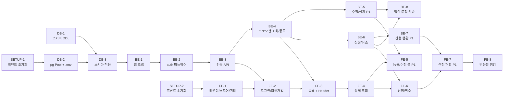

# 실행 계획 (3일, 1인 개발)

> `doc/2-PRD.md`를 기준으로 하고, 구조/컨벤션은 `doc/5-project-principle.md`, 스키마는 `doc/8-erd.md`, 화면은 `doc/7-wireframe.md`를 따른다. 각 task는 독립적으로 착수·완료 가능한 단위로 분해했으며, 완료 조건을 모두 만족해야 다음 단계로 넘어간다.
>
> 우선순위는 PRD 6장 표기(P0/P1)를 그대로 따른다. **일정이 밀리면 P1 task부터 축소한다.**

---

## 0. Task 의존 관계

## 0-1. 일정 배치 (PRD 9장)

| Day   | Task                                                                   |
| ----- | ---------------------------------------------------------------------- |
| Day 1 | SETUP-1, SETUP-2, DB-1(완료), DB-2, DB-3, BE-1, BE-2, BE-3, FE-1, FE-2 |
| Day 2 | BE-4, BE-5, FE-3, FE-4, FE-5                                           |
| Day 3 | BE-6, BE-7, BE-8, FE-6, FE-7, FE-8                                     |

---

## 1. 기반 세팅

### SETUP-1. 백엔드 프로젝트 초기화

- **선행 task**: 없음
- **작업**: `backend/`에 npm 프로젝트를 만들고 런타임 의존성만 설치한다. 설치 대상은 `express`, `pg`, `bcrypt`, `jsonwebtoken`, `cors`, `dotenv`로 한정한다(그 외 라이브러리 추가 금지 — 원칙 5장).
- **완료 조건**
  - [ ] `backend/package.json`이 생성되고 위 6개 의존성만 존재한다
  - [ ] `npm start`로 서버 실행이 가능한 스크립트가 정의되어 있다
  - [ ] `.gitignore`에 `node_modules`, `.env`가 포함되어 있다

### SETUP-2. 프론트엔드 프로젝트 초기화

- **선행 task**: 없음 (SETUP-1과 병행 가능)
- **작업**: Vite로 `frontend/` React 19 프로젝트를 생성하고 `zustand`, `@tanstack/react-query`, `react-router-dom`을 설치한다. `doc/5-project-principle.md` 6장의 디렉토리(`api/`, `store/`, `pages/`, `components/`)를 빈 폴더로 만든다.
- **완료 조건**
  - [ ] `npm run dev`로 개발 서버가 기동되고 기본 화면이 렌더링된다
  - [ ] React 19 + zustand + TanStack Query + react-router-dom이 설치되어 있다
  - [ ] `src/api/`, `src/store/`, `src/pages/`, `src/components/` 폴더가 존재한다

---

## 2. 데이터베이스

### DB-1. 스키마 DDL 작성 ✅ 완료

- **선행 task**: 없음
-
- **작업**: `doc/8-erd.md` 기준으로 `users`/`promotions`/`applications` 3개 테이블 DDL을 PostgreSQL 문법으로 작성.
- **완료 조건**
  - [x] `backend/src/db/schema.sql`에 3개 테이블 DDL이 존재한다
  - [x] `email` 유니크, `(promotion_id, user_id)` 유니크, `promotion_id` ON DELETE CASCADE 제약이 반영되어 있다
  - [x] `event_date >= apply_end_at` CHECK 제약이 반영되어 있다
  - [x] `promotions.applied_count`(현재 신청 인원 카운터)와 `0 <= applied_count <= capacity` CHECK 제약이 반영되어 있다

### DB-2. pg Pool 연결 및 환경변수

- **선행 task**: SETUP-1
- **작업**: `backend/src/db/pool.js`에 `pg` Pool을 환경변수 기반으로 구성하고, `backend/.env.example`에 필요한 키(DB 접속 정보, `JWT_SECRET`, `PORT`, 프론트 오리진)를 정의한다. 실제 `.env`는 커밋하지 않는다.
- **완료 조건**
  - [ ] `pool.js`가 환경변수로 접속 정보를 읽고 Pool 인스턴스를 export한다
  - [ ] `.env.example`에 모든 필요 키가 값 없이 나열되어 있다
  - [ ] `.env`가 git에 추적되지 않는다

### DB-3. 로컬 DB에 스키마 적용 및 접속 검증

- **선행 task**: DB-1, DB-2
- **작업**: 로컬 PostgreSQL 17에 데이터베이스를 만들고 `schema.sql`을 실행한다. Pool을 통해 실제 쿼리가 성공하는지 확인한다.
- **완료 조건**
  - [ ] `schema.sql`이 오류 없이 실행되어 3개 테이블이 생성된다
  - [ ] `SELECT 1` 수준의 쿼리가 `pool.js`를 통해 성공한다
  - [ ] 제약 위반 케이스(중복 email 삽입, 진행일 < 신청 종료일 삽입)가 DB에서 거부되는 것을 확인했다

---

## 3. 백엔드

### BE-1. Express 앱 조립 및 공통 미들웨어

- **선행 task**: DB-3
- **작업**: `app.js`(앱 조립·라우터 등록·cors)와 `server.js`(실행 진입점), `middleware/errorHandler.js`(단일 에러 핸들러)를 작성한다. CORS는 프론트 오리진만 허용한다. 커스텀 에러 클래스 계층은 만들지 않는다.
- **완료 조건**
  - [ ] 서버가 지정 포트로 기동되고 헬스 확인용 응답이 반환된다
  - [ ] 프론트 오리진에서의 요청만 CORS 허용된다
  - [ ] 라우트에서 던진 에러가 errorHandler 하나를 통해 일관된 상태 코드/메시지로 반환된다

### BE-2. JWT 인증 미들웨어

- **선행 task**: BE-1
- **작업**: `middleware/auth.js`에서 `Authorization` 헤더의 access token을 검증하고 `req.user`(id, role)를 주입한다. 검증 실패 시 401을 반환한다.
- **완료 조건**
  - [ ] 유효한 access token이면 `req.user`에 id와 role이 주입된다
  - [ ] 토큰 없음/위조/만료 시 401이 반환된다
  - [ ] 역할 검사(MANAGER 전용 라우트 차단)가 이 미들웨어 또는 라우트 레벨에서 가능하다

### BE-3. 인증 API (회원가입 / 로그인 / 토큰 재발급) — P0

- **선행 task**: BE-2
- **작업**: `user/userQueries.js`(SQL)와 `user/userRoutes.js`(라우터 겸 서비스)를 작성한다. 회원가입 시 비밀번호를 bcrypt로 해시 저장하고 역할을 받는다. 로그인 시 access token(짧은 만료)과 refresh token(긴 만료)을 함께 발급하며, refresh token은 무상태로 서명만 검증해 access token을 재발급한다(별도 테이블 없음 — PRD 7장).
- **완료 조건**
  - [ ] 이름/이메일/비밀번호/역할로 회원가입이 성공하고 비밀번호가 평문으로 저장되지 않는다
  - [ ] 중복 이메일 가입 시도가 409(또는 정의된 실패 응답)로 거부된다
  - [ ] 올바른 이메일/비밀번호로 로그인 시 access token과 refresh token이 함께 반환된다
  - [ ] 잘못된 자격증명 로그인이 401로 거부된다
  - [ ] refresh token으로 새 access token을 재발급받을 수 있다

### BE-4. 프로모션 등록 및 목록/상세 조회 API — P0

- **선행 task**: BE-3
- **작업**: `promotion/promotionQueries.js`와 `promotion/promotionRoutes.js`를 작성한다. 등록은 MANAGER만 허용하고 `event_date >= apply_end_at`를 검증하며 `applied_count`는 0으로 시작한다. 목록/상세는 두 역할 공통이며 모집 인원과 **현재 신청 인원**(`applied_count` 컬럼 값)을 함께 반환한다. 응답 DTO 키는 camelCase로 변환한다(원칙 3장).
- **완료 조건**
  - [ ] MANAGER가 제목/내용/신청기간/진행일/모집인원으로 프로모션을 등록할 수 있다
  - [ ] PARTICIPANT의 등록 요청이 403으로 거부된다
  - [ ] 진행일이 신청 종료일보다 이전이면 400으로 거부된다
  - [ ] 필수 항목 누락 시 400으로 거부된다
  - [ ] 목록/상세 응답에 모집 인원과 현재 신청 인원이 포함되고 키가 camelCase다

### BE-5. 프로모션 수정/삭제 API — P1

- **선행 task**: BE-4
- **작업**: 등록자 본인만 수정/삭제 가능하도록 소유권을 검사한다. 신청자가 있는 경우 모집 인원을 현재 신청 인원 미만으로 축소할 수 없다. 삭제 시 신청 기록은 FK CASCADE로 함께 제거된다.
- **완료 조건**
  - [ ] 등록자 본인만 수정/삭제할 수 있고 타인 요청은 403으로 거부된다
  - [ ] 현재 신청 인원보다 작은 모집 인원으로 수정 시 400으로 거부된다
  - [ ] 프로모션 삭제 시 해당 프로모션의 신청 기록이 함께 삭제된다
  - [ ] 수정 시에도 진행일 ≥ 신청 종료일 검증이 적용된다

### BE-6. 참가 신청 및 취소 API — P0

- **선행 task**: BE-4
- **작업**: `application/applicationQueries.js`와 `application/applicationRoutes.js`를 작성한다. PARTICIPANT만 신청 가능하며 신청자는 `req.user`에서 가져온다(클라이언트 입력 신뢰 금지). 신청 기간 내 여부를 검증하고, 중복 신청은 `(promotion_id, user_id)` 유니크 제약으로 차단한다. 정원 초과는 **하나의 트랜잭션 안에서 `UPDATE promotions SET applied_count = applied_count + 1 WHERE id = ? AND applied_count < capacity`를 실행하고, 갱신된 행이 0건이면 정원 마감으로 거부, 1건이면 같은 트랜잭션에서 `applications`에 INSERT**해 PRD 8장이 지정한 방식 그대로 원자적으로 처리한다(`doc/8-erd.md` PROMOTION 설명 참고). 취소는 본인 신청만 가능하며, 같은 트랜잭션에서 `applications` 삭제와 `applied_count` 1 감소를 함께 수행한다.
- **완료 조건**
  - [ ] PARTICIPANT가 기간 내 프로모션에 신청하면 신청 기록이 생성되고 `applied_count`가 1 증가한다
  - [ ] 동일 사용자가 같은 프로모션에 재신청하면 중복으로 거부된다
  - [ ] 신청 기간이 아닌 프로모션 신청 요청이 서버에서 거부된다
  - [ ] 정원이 찬 프로모션 신청이 거부되고, 동시 요청 시에도 `applied_count`가 `capacity`를 넘지 않는다
  - [ ] 본인 신청만 취소되고 타인 신청 취소 요청은 403으로 거부된다
  - [ ] 신청 취소 성공 시 `applied_count`가 1 감소하고 `applications` 실제 행 수와 일치한다
  - [ ] 신청자 ID를 요청 본문으로 위조해도 무시되고 토큰의 사용자로 기록된다

### BE-7. 신청 현황 및 신청자 목록 API — P1

- **선행 task**: BE-6
- **작업**: MANAGER가 **본인이 등록한** 프로모션의 현재 신청 인원과 신청자 목록(이름, 신청 일시)을 조회하는 엔드포인트를 작성한다.
- **완료 조건**
  - [ ] 본인 등록 프로모션의 신청 인원과 신청자 목록(이름, 신청 일시)이 반환된다
  - [ ] 타인이 등록한 프로모션 조회 요청이 403으로 거부된다
  - [ ] 신청자가 없으면 빈 배열이 반환된다(에러가 아님)

### BE-8. 핵심 비즈니스 로직 검증

- **선행 task**: BE-5, BE-6
- **작업**: `doc/5-project-principle.md` 4장이 지정한 4개 항목만 Node 내장 `node:test`로 검증한다. 별도 테스트 프레임워크·E2E·커버리지는 만들지 않는다.
- **완료 조건**
  - [ ] 중복 신청 방지 검증이 통과한다
  - [ ] 정원 초과 검증이 동시 신청 시나리오(병렬 요청)에서 통과한다
  - [ ] 진행일 ≥ 신청 종료일 검증이 통과한다
  - [ ] 신청자 존재 시 정원 축소 제한 검증이 통과한다
  - [ ] `node --test`로 전체 실행이 성공한다

---

## 4. 프론트엔드

### FE-1. 라우팅 · 인증 스토어 · 쿼리 기반

- **선행 task**: SETUP-2
- **작업**: `App.jsx`에 6개 페이지 라우트를 등록하고 QueryClientProvider를 설정한다. `store/authStore.js`(Zustand)에 로그인 사용자 정보와 토큰만 담는다. API 호출 함수에서 access token 첨부와 401 시 refresh 재시도를 처리한다. 별도 서비스/리포지토리 레이어는 만들지 않는다.
- **완료 조건**
  - [ ] 6개 라우트(로그인/회원가입/목록/상세/폼/신청현황)가 등록되어 이동된다
  - [ ] 비로그인 상태로 인증 필요 화면 접근 시 로그인 화면으로 리다이렉트된다
  - [ ] authStore에 로그인 사용자 정보와 토큰만 저장되고 서버 데이터는 담기지 않는다
  - [ ] API 요청에 access token이 자동 첨부되고, 401 시 refresh로 1회 재시도된다

### FE-2. LoginPage / SignupPage — P0

- **선행 task**: FE-1, BE-3
- **작업**: `doc/7-wireframe.md` 1·2번 화면대로 구현한다. 회원가입은 이름/이메일/비밀번호 + 역할 선택, 로그인 성공 시 역할에 맞는 화면으로 진입한다. 날짜·필수값 등 입력 검증은 브라우저 기본 기능(`required`, `type="email"`)을 우선 사용한다.
- **완료 조건**
  - [ ] 회원가입 후 로그인까지 화면에서 연속 수행된다
  - [ ] 이메일 중복 시 "이미 사용 중인 이메일" 안내가 노출된다
  - [ ] 로그인 실패 시 실패 안내가 노출된다
  - [ ] 로그인 성공 시 역할에 맞는 화면으로 이동한다

### FE-3. Header + PromotionListPage — P0

- **선행 task**: FE-2, BE-4
- **작업**: `components/Header.jsx`(로고, 사용자 이름, 로그아웃)와 `PromotionListPage`, `PromotionCard`를 구현한다. 카드에는 제목/신청기간/모집인원/현재신청인원을 노출하고, MANAGER 로그인 시에만 "프로모션 등록" 버튼을 보인다. 로그아웃은 클라이언트에서 토큰을 폐기한다.
- **완료 조건**
  - [ ] 프로모션 목록이 카드 형태로 렌더링되고 모집/신청 인원이 표시된다
  - [ ] MANAGER에게만 "프로모션 등록" 버튼이 보인다
  - [ ] 목록이 비어 있으면 "등록된 프로모션 없음"이 노출된다
  - [ ] 카드 클릭 시 상세 화면으로 이동한다
  - [ ] 로그아웃 시 토큰이 폐기되고 로그인 화면으로 이동한다

### FE-4. PromotionDetailPage (조회) — P0

- **선행 task**: FE-3
- **작업**: 제목/내용/신청기간/진행일/모집인원/현재신청인원을 표시한다. 역할과 소유권에 따라 하단 버튼 영역의 표시 대상을 분기한다(취식자: 신청/취소, 등록자 영양사: 수정/삭제).
- **완료 조건**
  - [ ] 상세 정보 6개 항목이 모두 표시된다
  - [ ] PARTICIPANT에게는 신청 관련 버튼 영역이, 등록자 MANAGER에게는 수정/삭제 버튼이 보인다
  - [ ] 타인이 등록한 프로모션에서는 MANAGER에게도 수정/삭제 버튼이 보이지 않는다

### FE-5. PromotionFormPage (등록/수정/삭제 공용) — P1

- **선행 task**: FE-4, BE-5
- **작업**: 등록과 수정을 한 화면에서 처리한다. 날짜 입력은 `<input type="date">`를 사용한다. 서버 검증 실패 메시지(진행일 제약, 정원 축소 제한)를 항목별로 노출하고, 신청자가 있는 프로모션 삭제 시 신청 기록도 함께 삭제됨을 확인 문구로 안내한다.
- **완료 조건**
  - [ ] 등록이 성공하면 목록에 새 프로모션이 반영된다
  - [ ] 수정이 성공하면 상세 화면에 변경 내용이 반영된다
  - [ ] 진행일 제약 위반 시 항목별 오류 문구가 노출된다
  - [ ] 정원 축소 제한 위반 시 "현재 신청 인원 미만으로 축소 불가" 안내가 노출된다
  - [ ] 삭제 시 신청 기록 동반 삭제를 알리는 확인 문구가 노출된 뒤 삭제된다

### FE-6. 참가 신청 / 취소 UI — P0

- **선행 task**: FE-4, BE-6
- **작업**: 상세 화면에서 신청/취소를 처리한다. 신청 종료일이 지났거나 정원이 찬 경우 버튼을 비활성화한다. 이미 신청한 상태면 "신청 완료" 표시와 취소 버튼을 노출한다. 성공 후 TanStack Query 캐시를 무효화해 신청 인원을 갱신한다.
- **완료 조건**
  - [x] 신청 성공 시 "신청 완료" 상태와 취소 버튼으로 화면이 전환된다
  - [x] 신청 취소 성공 시 다시 신청 가능 상태로 화면이 갱신된다
  - [x] 신청 종료일이 지난 프로모션의 신청 버튼이 비활성화된다
  - [x] 정원이 찬 프로모션의 신청 버튼이 비활성화된다
  - [x] 서버가 중복 신청 또는 정원 마감으로 거부하면 각각의 안내가 노출된다
  - [x] 신청/취소 후 현재 신청 인원이 화면에 즉시 반영된다

### FE-7. ApplicationStatusPage — P1

- **선행 task**: FE-6, BE-7
- **작업**: 영양사가 본인 등록 프로모션의 모집/신청 인원과 신청자 목록(이름, 신청 일시)을 테이블로 확인하는 화면을 구현한다.
- **완료 조건**
  - [x] 프로모션 제목, 모집 인원, 현재 신청 인원이 표시된다
  - [x] 신청자 목록이 이름·신청 일시 테이블로 표시된다
  - [x] 신청자가 없으면 "신청자 없음"이 노출된다
  - [x] 타인 등록 프로모션 접근 시 권한 없음으로 처리된다

### FE-8. 반응형 점검

- **선행 task**: FE-7
- **작업**: `doc/7-wireframe.md`의 모바일 레이아웃 지침대로 6개 화면을 모바일 폭에서 점검한다. 모바일 전용 최적화나 접근성 작업은 범위 외다(PRD 7장).
- **완료 조건**
  - [x] 6개 화면 모두 모바일 폭에서 가로 스크롤 없이 표시된다
  - [x] 목록 카드가 모바일에서 전체 폭을 사용하고 등록 버튼이 헤더 아래로 배치된다
  - [x] 폼 화면에서 신청 시작일/종료일이 모바일에서 세로로 쌓인다
  - [x] 신청 현황의 신청자 테이블이 모바일에서 카드 형태로 표시된다

---

## 5. 최종 인수 조건

PRD 1장의 핵심 흐름이 끊김 없이 동작하는 것이 최우선이다.

- [ ] 회원가입 → 로그인 → 영양사 프로모션 등록 → 취식자 조회·신청 → 영양사 신청 현황 확인이 실제 화면에서 연속 수행된다
- [ ] PRD 6장 P0 기능 5개가 모두 동작한다
- [ ] BE-8의 4개 검증이 모두 통과한다
- [ ] PRD 4장 "제외" 항목이 구현되지 않았다

---

## 6. 설계 결정 기록

**정원 초과 원자적 검증 방식**: PRD 8장이 지정한 `UPDATE ... WHERE 신청인원 < 모집인원` 단일 쿼리 방식을 그대로 채택했다. 이를 위해 `promotions`에 `applied_count` 카운터 컬럼을 추가했다(`doc/8-erd.md`, `schema.sql` 반영 완료). BE-6에서 신청/취소 시 `applications` 테이블과 `applied_count`를 반드시 같은 트랜잭션 안에서 함께 갱신해 두 값의 불일치를 막는다. 테이블 수는 여전히 3개(User/Promotion/Application)로 유지된다.
